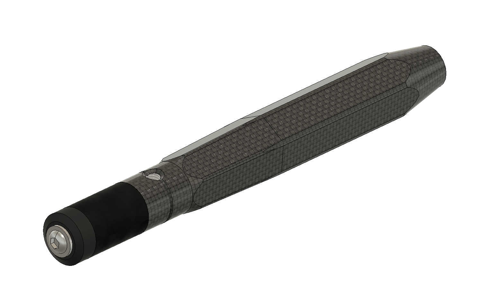
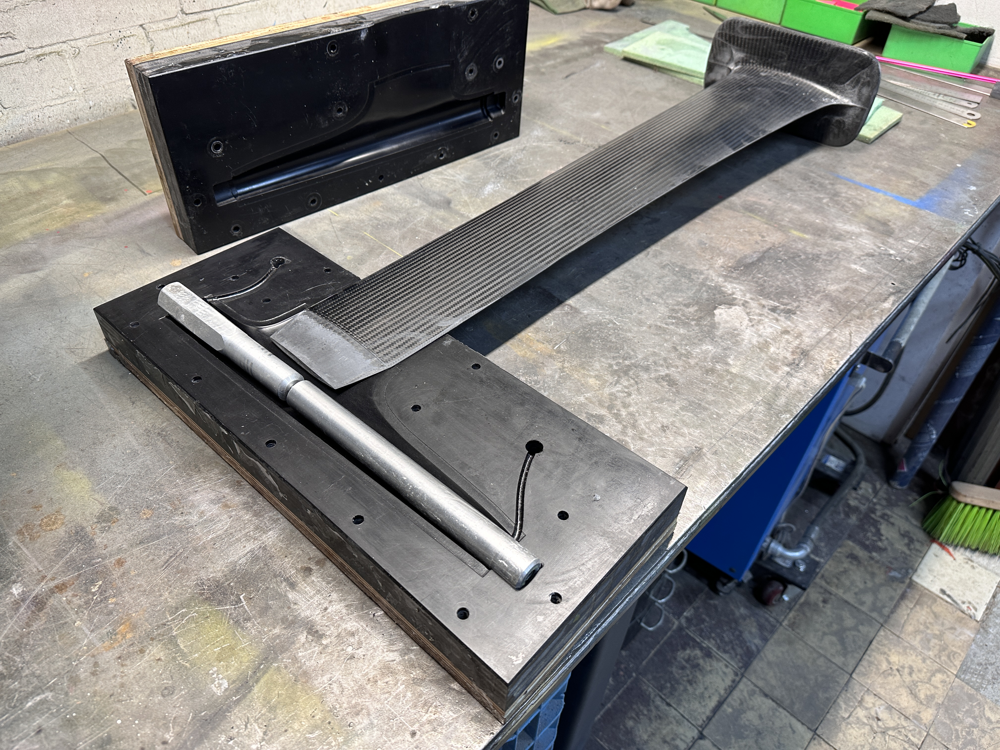
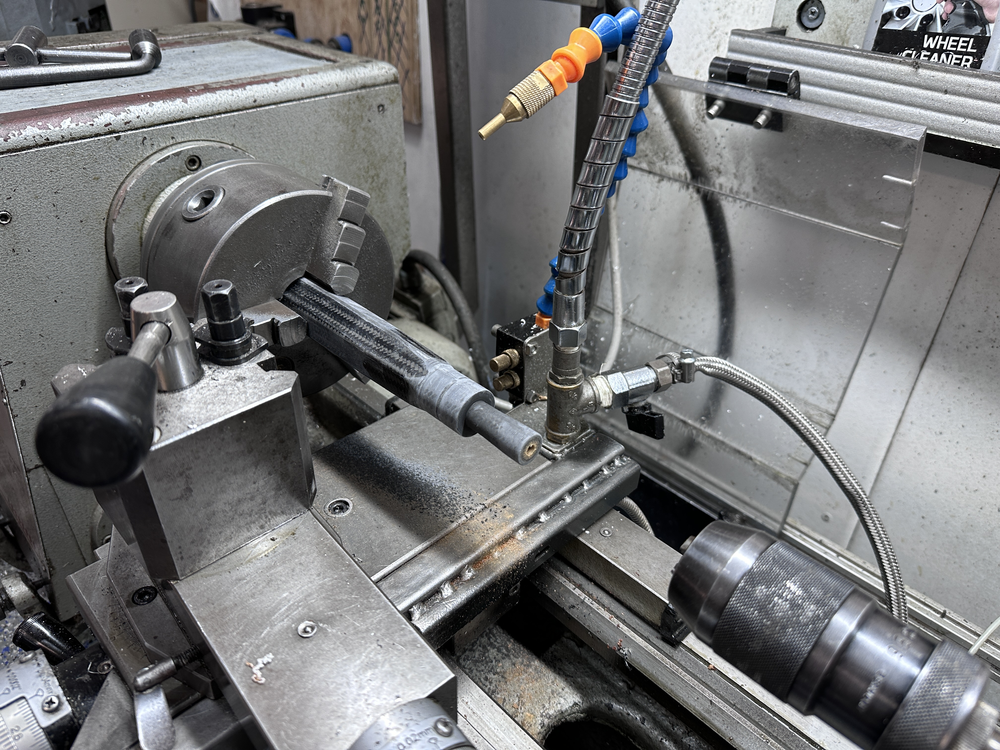
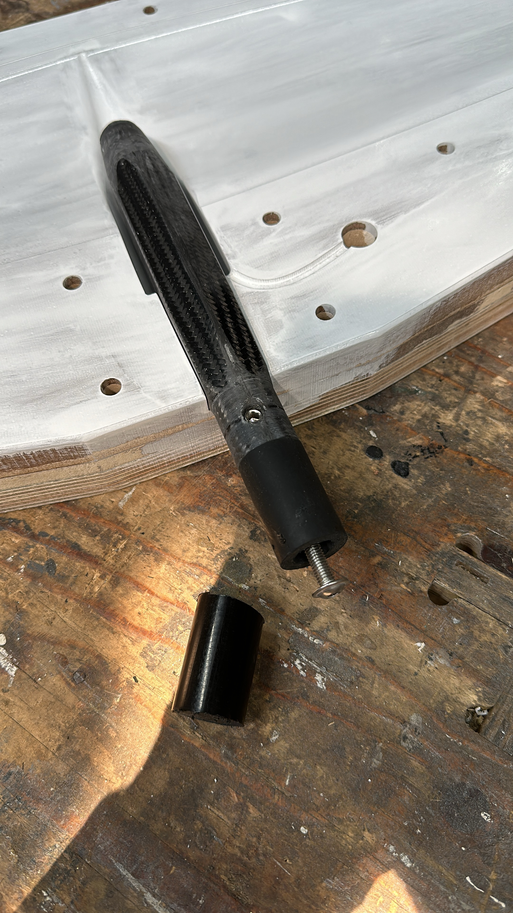

# MS-Connector
Design and engineering files for an open hydrofoil connector system

The first challenge I encountered when I started building hydrofoils was thinking up a connection system between mast, fuselage and wings. After many iterations, I arrived on the system, and it has served me well for over three years now. It has proven to be strong and durable for me and my friends who are using foils I built for them, the foils that I built three years ago are still perfectly fine.

## Advantages
This connection system has several advantages over other solutions:
- Everything goes together with a single tool: a long 4 mm allen key. Assembling the foil and taking it apart is faster compared to systems that use screws.
- There are no loose screws, so loosing a screw or using the wrong one is not a thing.
- It has reasonably relaxed tolerances, and can be manufactured using the tools that I have access to at my makerspace from carbon and epoxy.[^1]
- Strong and stiff even for wide-span pump foils.
- Tolerant to salt and sand, does not corrode even when leaving assembled for a long time.
- Hydrodynamically efficient, maybe not quite as good as some race setups but still quite good.
[^1]: These tools do include a lathe, metal mill and cnc router. It would also be possible to order the metal parts and mold once from an online service. However the lathe is used for every connector made, so it is important to have.

## How does it work
This system, that I'll name the MS connector (my initials) has a 38 mm (1.5") outer diameter fuselage. This fuselage is molded rigidly to the mast, making this strong and stiff. The front foil has a connector that is pulled into the fuselage. The connector is made separately and is molded inside the front wing. Making it as a small separate part makes it easy to drill and tap the screw holes, and make it to size perfectly before the foil makes it impractical to work on.
The connector has 4 distinct parts, each part having a distinct function:
1) a straight hexagon part at 28 mm key thickness, that is molded inside the foil, sticking out 10mm to prevent wiggling loose
2) a tapered hexagon part, tapering from 28 mm back to 25mm over 60mm length. This tightens the foil inside the fuselage and transfers the load.
3) a 25 mm round part, 20 mm long. In the middle is a grub screw that is used as extra lock.
4) a 25 mm round rubber cylinder, 40 mm long, that runs over a "reverse taper" inside, with an end cap and a flathead screw on the end. The inner diameter tapers out from 14 mm to 16 mm.

The fuselage has a cavity that matches the connector shape. After inserting the connector into the fuselage, a long allen key coming in from the back is used to tighten the screw and compress the rubber cylinder. This expands against the inner wall, then the reverse taper will pull the connector in, firmly tightening the tapered part. Then the grub screw is tightened, it will push against the wall, preventing the connector from falling out even if the primary mechanism slips or fails.
The tapered part will make a very tight connection, it will not come loose easily. When disassembling, first loosen up the grub screw, then loosen the end cap screw. Inside the fuselage there is a hole in the center that the allen key fits through (making it easy to find the screw), but the hole is smaller than the screw head. Reversing the screw until the head hits the internal hole, that will push the foil out from its tight fit without much force.

## Stabilizer connection
For the stabilizer connection, a 25 mm carbon round tube is used. It is placed in line with the front wing and slides in after the front wing is attached. Because it slides and is fixed with set screws, the stabilizer length can be adjusted. The set screws are 22.5 mm apart, two or three small holes in the fuselage 45 mm apart are used to screw these in. In the center of the carbon tube is SRFB/Tufnol rod, for M8 threaded holes. This system was actually not designed by me, it was invented by Woody Cookie from Scheveningen. The round shape requires the user to set it horizontally by hand before tightening the screws, but the advantage is that sand does not lock up the mechanism.

## Screws
Note M8 set screws (ISO 4027) and M6 flange screws (ISO 7380-2) both fit a 4 mm allen key. That is why these are used throughout.

## Manufacturing
For manufacturing this, I use two aluminium metal parts that are molded in when making the fuselage. 

After demolding the fuselage, I leave the aluminium parts inside and post-cure the mast/fuselage at 60 degrees for 6 hours (consistent with the epoxy manufacturer guidelines). This makes the aluminium expand during post-cure, after cooling down the aluminium parts are pulled out easily using a pully and M16 screw. This creates a cavity that precisely matches the connector, with 0.1 mm play for sand.

For the connector that is actually going into the front wing I use a mold that is made from 25 mm thick HPL (Trespa brand) plastic using a CNC router. In the center I use a 6 mm wooden stick connected to a 80mm SRBF (Tufnol) rod (10 mm diameter) at the threaded end part. This center is tightly wrapped in carbon (0 and 45 degrees) and infused under vacuum. The 28 mm hexagon from sold carbon fiber should be plenty strong to carry the load of a front wing. After it is demolded, it is post processed on the lathe to make the circular part perfectly round and tap a long M6 thread in the center.

After the connector part is drilled and tapped, it is molded inside a front wing.

